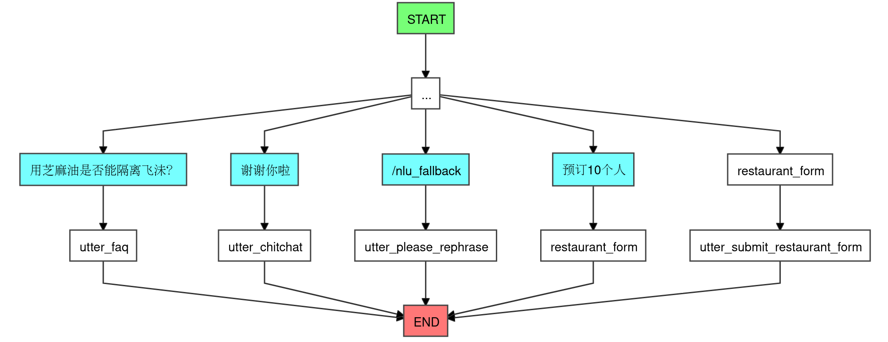

Rasa Examples
=============



## 环境准备

```shell
poetry install
```

## 训练

```shell
rasa train
```

## 使用

- 启动 Actions Server

  ```
  rasa run actions
  ```

- 交互式使用:

  ```shell
  rasa shell
  ```

- 或者启动服务

  ```
  rasa run
  ```

  然后通过 HTTP 请求来使用

  ```shell
  curl localhost:5005/model/parse -d '{"text":"hello"}'
  ```

- 或者在代码中使用

  ```python
  import asyncio
  from rasa.core.agent import Agent

  agent = Agent.load('models/')
  result = asyncio.run(agent.parse_message('hello'))
  print(result)
  ```
